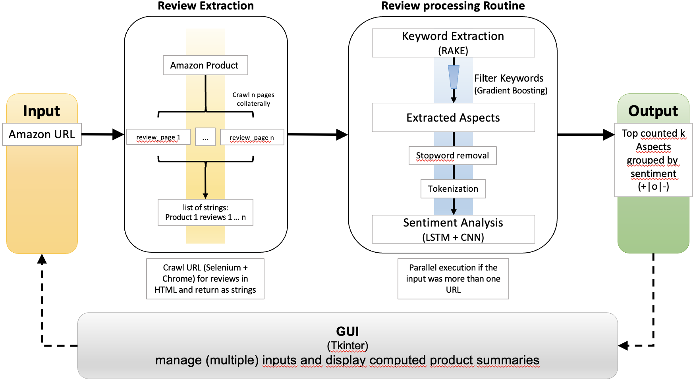

# Amazon Aspect Extractor

## Project Description  

This project aims to extract and compile information about products on Amazon from its reviews.  
Keyword extraction and Sentiment Analysis are employed in order to compute statistics and summaries of products given their URLs.  

### Processing pipeline

### Training State:
Results of best sentiment model on custom Laptop dataset:

|Split \ Metric|Accuracy|Class balanced accuracy|F1 Score|Class Splits|
|--------------|--------|-----------------------|--------|------------|
|LSTM Training|81.58%|85.25%|0.8407|-|
|LSTM Validation|68.12%|62.38%|0.7713|28.12%/8.75%/63.13%|
|LSTM Test|90.37%|64.56%|0.8787|-|
|Random Forest Training|62.22%|72.24%|0.5755|-|
|Random Forest Validation|57.63%|54.22%|0.4716|55.56%/9.03%/35.42%|
|Random Forest Test|55.00%|60.27%|0.4912|-|
|SVM Training|72.50%|65.63%|0.6480|-|
|SVM Validation|62.50%|36.59%|0.3619|14.89%/4.17%/81.94%|
|SVM Test|62.77%|41.17%|0.4066|-|
|Validation Set|-|-|-|37.97%/3.21%/58.82%|

### Sources:

#### Training Data:
- https://alt.qcri.org/semeval2015/task12/index.php?id=data-and-tools
- https://europe.naverlabs.com/research/natural-language-processing/aspect-based-sentiment-analysis-dataset/

#### Pre-crawled  Amazon reviews:
- https://registry.opendata.aws/amazon-reviews-ml/

#### Existing Code Fragments:  
- Sentiment LSTM: https://towardsdatascience.com/sentiment-analysis-using-lstm-step-by-step-50d074f09948  
- Dynamic input sizes for LSTMs: https://towardsdatascience.com/taming-lstms-variable-sized-mini-batches-and-why-pytorch-is-good-for-your-health-61d35642972e  

#### Utilized libraries:
- see requirements.txt  
- Google Chrome, available https://www.google.com/chrome/
- chromedriver, available: https://chromedriver.chromium.org/downloads

### Team members:  
- Christopher Brückner (christopher.brueckner95@gmail.com)
- Julius Ernesti (juliusernesti@yahoo.de)
- Raphael Kirchholtes (kirchholtes@stud.uni-heidelberg.de)
- Armand Rousselot (armand.r@live.de)
