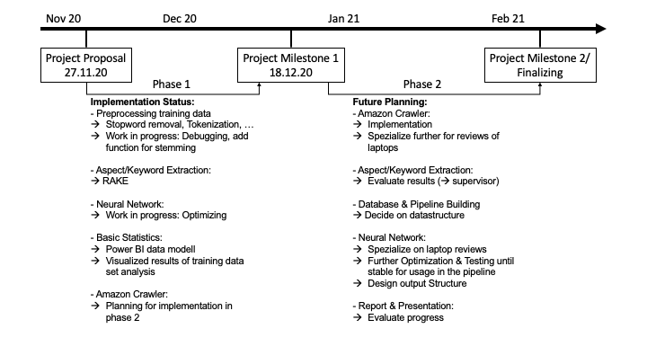
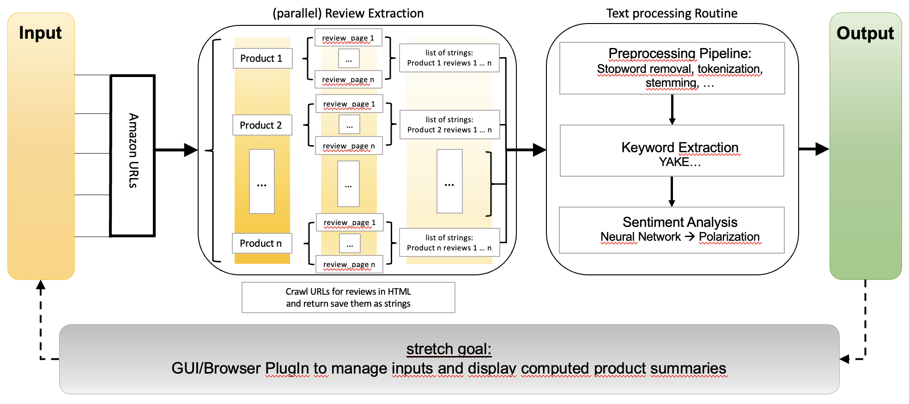

# Amazon Aspect Extractor

### Team members:  
- Christopher Brückner
- Julius Ernesti
- Raphael Kirchholtes
- Armand Rousselot

### Mail Addresses:  
- christopher.brueckner95@gmail.com
- juliusernesti@yahoo.de
- kirchholtes@stud.uni-heidelberg.de
- armand.r@live.de

### Existing Code Fragments:  
- Sentiment LSTM: https://towardsdatascience.com/sentiment-analysis-using-lstm-step-by-step-50d074f09948  
- Dynamic input sizes for LSTMs: https://towardsdatascience.com/taming-lstms-variable-sized-mini-batches-and-why-pytorch-is-good-for-your-health-61d35642972e  

### Utilized libraries: 
- see requirements.txt  
- Google Chrome, available https://www.google.com/chrome/
- chromedriver, available: https://chromedriver.chromium.org/downloads

## Project State

### Planning State:

- Stretch Goal: GUI (Simple Tkinter/Browser-PlugIn) 

### Training State:
Results of current best sentiment model

|Split \ Metric|Accuracy|Class balanced accuracy|F1 Score|Class Splits|
|--------------|--------|-----------------------|--------|------------|
|LSTM Training|86.20%|72.92%|0.8698|-|
|LSTM Validation|77.81%|58.24%|0.7676|21.88%/4.92%/73.20%|
|Random Forest Training|76.81%|36.21%|0.3389|-|
|Random Forest Validation|77.04%|33.82%|0.3180|1.23%/3.28%/95.49%|
|SVM Training|80.23%|42.88%|0.4585|-|
|SVM Validation|78.68%|36.03%|0.3501|3.69%/0.00%/96.31%|
|Validation Set|-|-|-|20.08%/1.80%/78.12%|

### Extraction State:
- See issue "Feature: Keyword Filter"  
- Missing: Accurate splitting of reviews into components containing both the extracted keyword and its associated sentiment terms  

## High-level Architecture Description:

### Processing pipeline

## Data Analysis

### Data Sources:

#### Training Data:
- https://alt.qcri.org/semeval2015/task12/index.php?id=data-and-tools
- https://europe.naverlabs.com/research/natural-language-processing/aspect-based-sentiment-analysis-dataset/

#### Pre-crawled  Amazon reviews:
- https://registry.opendata.aws/amazon-reviews-ml/

### Preprocessing:

The implementation of our crawler is still a work in progress. 
A uniform document schema for the crawled data to ensure its quality will be developed later on.

### Basic Statistics:

#### Training Datasets

<table style="width:30rem">
  <tr>
    <th>Dataset</th>
    <th>#(Reviews)</th> 
    <th>Opinions per Review</th>
    <th>Polarity</th>
    <th></th>
    <th></th> 
  </tr>
  <tr>
    <th></th>
    <th></th> 
    <th></th>
    <th>(+)</th>
    <th>(0)</th>
    <th>(-)</th>
  </tr>
  <tr>
    <td>laptopdata</td>
    <td>340</td> 
    <td>8.35</td>
    <td>1103</td> 
    <td>106</td>
    <td>765</td>
  </tr>
  <tr>
    <td>restaurantsdata</td>
    <td>195</td> 
    <td>7.28</td>
    <td>1198</td> 
    <td>53</td>
    <td>403</td>
  </tr>
  <tr>
    <td>foursquare_gold</td>
    <td>157</td> 
    <td>2.24</td>
    <td>946</td> 
    <td>18</td>
    <td>191</td>
  </tr>
</table> 

The overall amount of training data is quite small for training a neural network.  
Another challenge is the uneven representation of classes.  

The following three plots visualize the distribution of our training data.  
Empty opinions are opinions in the dataset which do not include a target category or polarity. 

#### Laptop:

#### Restaurant:

#### Foursqare:

### Examples:

|reviewid|text                                                                                                                                                                                                       |category                     |polarity|
|--------|-----------------------------------------------------------------------------------------------------------------------------------------------------------------------------------------------------------|-----------------------------|--------|
|239     |(I found a 2GB stick for a bit under $50)                                                                                                                                                                  |                             |        |
|239     |Bottom line, I doubt you'd be overly disappointed if you invest in this machine.                                                                                                                           |LAPTOP#GENERAL               |positive|
|239     |If what you need is a machine to do some surfing, email checking, word processing, and watching a movie or two, this is the machine you want.                                                              |LAPTOP#MISCELLANEOUS         |positive|
|239     |If you want a little more custom ability, drop a few bucks and upgrade to one of the more robust versions of Win 7 and grab a 2GB stick of memory to spice it all up a bit more.                           |                             |        |
|239     |It's priced very reasonable and works very well right out of the box.                                                                                                                                      |LAPTOP#OPERATION_PERFORMANCE |positive|
|239     |It's priced very reasonable and works very well right out of the box.                                                                                                                                      |LAPTOP#PRICE                 |positive|
|239     |My ONLY issues are:                                                                                                                                                                                        |                             |        |
|239     |Nice and portable and definitely a decent enough system to keep you entertained while sitting in the airplane for a couple of hours, or at the hotel taking care of some last minute details and documents.|LAPTOP#GENERAL               |positive|
|239     |Nice and portable and definitely a decent enough system to keep you entertained while sitting in the airplane for a couple of hours, or at the hotel taking care of some last minute details and documents.|LAPTOP#MISCELLANEOUS         |positive|
|239     |Nice and portable and definitely a decent enough system to keep you entertained while sitting in the airplane for a couple of hours, or at the hotel taking care of some last minute details and documents.|LAPTOP#PORTABILITY           |positive|
|239     |That being said, it still runs video in full screen decently.                                                                                                                                              |DISPLAY#OPERATION_PERFORMANCE|neutral |
|239     |the screen/video resolution won't increase to a higher resolution then 1024 x 60                                                                                                                           |DISPLAY#QUALITY              |negative|
|239     |The sound is a bit quiet if you're on a plane, this can easily be overcome with a decent pair of head phones.                                                                                              |MULTIMEDIA_DEVICES#QUALITY   |neutral |

### Deepnote-Reading Access:
https://deepnote.com/project/c0f53828-5296-4fd9-84e1-b3660423ecac
